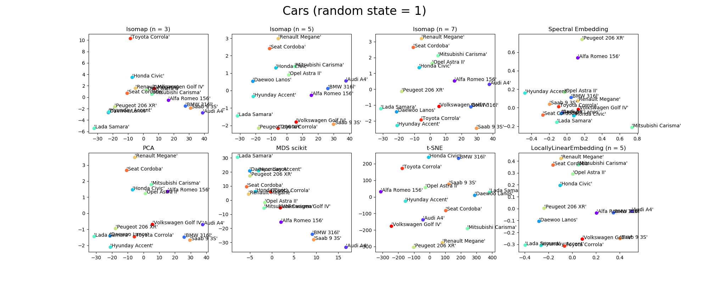
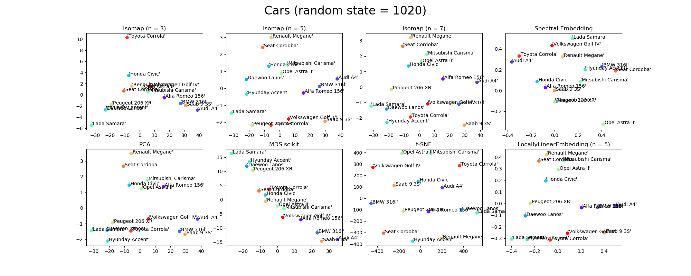
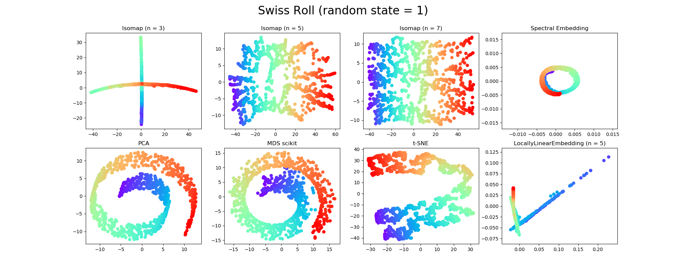
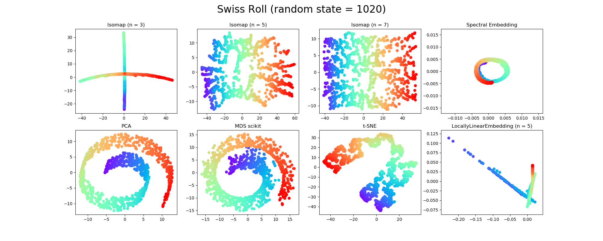
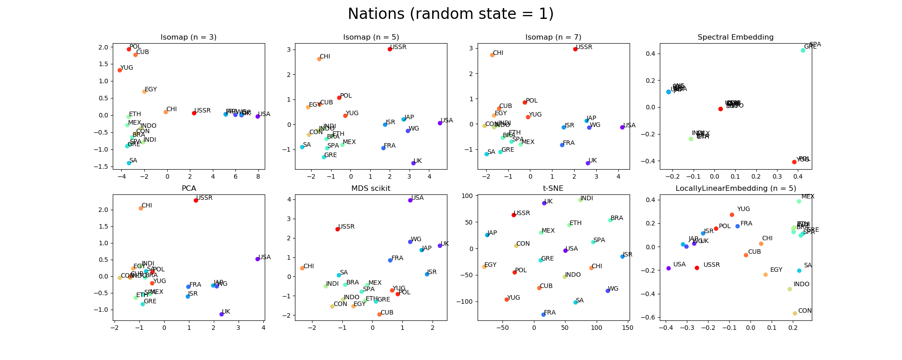
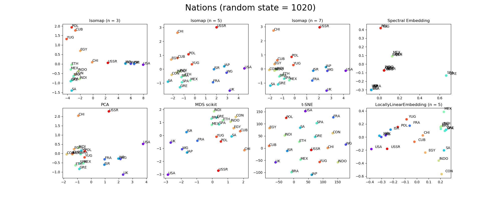
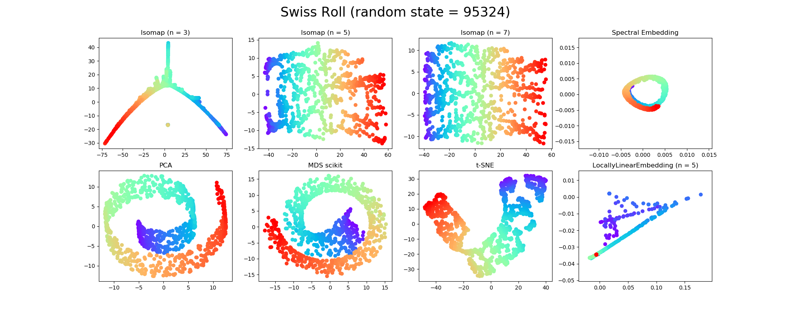

## Sprawozdanie 

### Wprowadzenie
Sprawozdanie dotyczy zadania nr 4.1, w którym należy porównać wybrane metody MDS na zadanych zbiorach danych, wraz z wybraną dodatkową metodą oraz zbiorem danych.

[Treść zadania](https://www.cs.put.poznan.pl/ibladek/students/skaiwd/lab5/zadania_mds.pdf) oraz [kod](./main.py).

#### Zastosowane metody
 - [Isomap](https://scikit-learn.org/stable/modules/generated/sklearn.manifold.Isomap.html) w wariantach dla *n = 3*, *5* oraz *7*
 - [PCA](https://scikit-learn.org/stable/modules/generated/sklearn.decomposition.PCA.html)
 - [MDS](https://scikit-learn.org/stable/modules/generated/sklearn.manifold.MDS.html) z pakietu sci-kit,
 - [T-SNE](https://scikit-learn.org/stable/modules/generated/sklearn.manifold.TSNE.html)
 - [SpectralEmbedding](https://scikit-learn.org/stable/modules/generated/sklearn.manifold.SpectralEmbedding.html) jako metoda dodatkowa.
 - [LocallyLinearEmbedding](https://scikit-learn.org/stable/modules/generated/sklearn.manifold.LocallyLinearEmbedding.html) z *n = 5* (domyślna wartość)
 
Z racji na wykorzystanie w częsci metod elementu losowości w celu lepszej wizualizacji były one uruchamiane dwukrotnie, z wykorzystaniem innego ziarna.
 
#### Wykorzystane zbiory danych
- [Cars](data/cars.csv)
- [Swiss Roll](http://people.cs.uchicago.edu/~dinoj/manifold/swissroll.html) - wygenerowane przez metodę
[`make_swiss_roll` pakietu scikit](https://scikit-learn.org/stable/modules/generated/sklearn.datasets.make_swiss_roll.html),
 dla 1000 próbek, bez szumu.
- [Nations](data/nations.csv) - zbiór [nations.dat](https://people.sc.fsu.edu/~jburkardt/datasets/mds/nations.dat)
pochodzący ze [zbiorów danych](https://people.sc.fsu.edu/~jburkardt/datasets/mds/mds.html)
dla metod MDS. Zawiera on porównanie 21 krajów pod względem 18 cech takich jak rozmiar, populacja czy bogatctwo.

### Omówienie
##### Cars

##### Swiss Roll

##### Nations

#### Wnioski
##### Isomap
Porównanie zaczniemy od zbioru *Cars*, od metody Isomap w wersji *n = 5*. Wskazała ona, że Megane jest daleko od Saab'a oraz blisko Seata.
Daleko od nich położona jest również Lada. Dane wyglądają nastepująco:

| C1 | C2 | C3 | **C4** | C5 |
| :--- | :--- | :--- | :--- | :--- |
| Renault Megane | 7.0 | 9.9 | **50.05** | 9 |
| Seat Cordoba | 8.3 | 10.9 | **44.99** | 8 |
| Saab 9 3S | 9.7 | 11.0 | **85.352** | 8 |
| Lada Samara | 7.2 | 13.0 | **24.9** | *2* |

Megane faktycznie ma zbiżone parametry do Cordoby. Saab bardzo od nich nie odbiega poza kryterium `C4`,
które prawdopodobnie robi różnice. Lada natomiast odbiega zarówno na `C4` w dół, jak i `C5`
Dodajmy do porównania Volkswagena Golfa, który jest po środku drogi między Ladą a Saabem:

 | C1 | C2 | C3 | C4 | C5 |
| :--- | :--- | :--- | :--- | :--- |
| Volkswagen Golf IV | 8.3 | 9.9 | 61.622 | 6 |

Wartość na atrybucie C4 znajduje się pomiędzy Ladą a Saabem, podobnie jak na `C5`.
Na `C1` i `C2` wartości są bliższe Megane i Cordobie; mimo to znalazł się bliżej Saaba i Lady.

Jeśli z kolei spojrzymy na Isomap z *n = 3* zaobserwujemy, że Megane, Seat i Golf są bardzo blisko siebie.
Lada jest wciąż daleko od nich wszystkich. Ciekawe jest to, że o ile wcześniej Corrola była stosunkowo blisko Lady, teraz są na przeciwległym końcu wykresu.

| C1 | C2 | C3 | C4 | C5 |
| :--- | :--- | :--- | :--- | :--- |
| Toyota Corrola | 7.7 | 10.2 | 50.358 | 4 |

Natomiast dna *n = 7* wykres dużo bardziej przypomina ten dla *n = 5*. Widać więc zastosowanie reguły minimalnej liczby podobnych przykładów - im mniejsze *n*,
tym bliżej znajdują się siebie przykłady (mniej potrzeba, aby utworzyły skupisko).

Dla zbioru Swiss roll przykład Isomap wydaje się być również ciekawy - wartości większych n sprawiają, że spirala jest bardziej rozwinięta przypominając ciągłą
przestrzeń, natomiast dla *n = 3* wynik jest ciekawy. Można zaryzykować stwierdzenie, że jest błędny biorąc pod uwagę górna część osi 'rzędnych' i lewa 'odciętych',
która składa się z przykładów turkusowych występujących oryginalnie blisko siebie.
 
Dla Nations sytuacja jest zbliżona do tej dla Cars. Ciekawe jest również to, że jest mało krajów podobnych do USRR,
a Polska jest podobna do Kuby czy Jugosławi - możliwe, że ze względu na okres w którym zbiór został przygotowany (blok komunistyczny).
Widzimy również, że kraje Europy zachodniej, Japonia czy USA leżą stosunkowo blisko siebie. Meksyk, Indie, Brazylia czy Grecja również tworzą pewną grupę.
Potwierdza się również, że USA i USSR są skrajnie różne i ciężko znaleźć coś pomiędzy nimi - przynajmniej dla *n >= 5*,
gdzie następuje rozwarstwienie krajów niebieskich.

##### MDS scikit oraz PCA
Powracając do zbioru Cars możemy zauważyć, że podobnie jak dla Isomap z *n = 5* PCA stwierdził, że Megane jest bliski Cordoby.
Ogólnie wyniki są całkiem zbliżone; największe różnice widać dla Alfy i BMW, które dla Isomap były bardzo blisko siebie,
natomiast dla PCA dzieli je pewna odległosć, zapewne ze względu na atrybut `C3`, który dla bliskiego BMW Audi jest na podobnym poziomie, jednak u Alfy odbiega:
 
| C1 | C2 | **C3** | C4 | C5 |
| :--- | :--- | :--- | :--- | :--- |
| Alfa Romeo 156 | 8.1 | **9.3** | 71.135 | 9 |
| Audi A4 | 7.9 | **11.9** | 93.351 | 10 |
| BMW 316l | 7.5 | **12.3** | 81.787 | 8 |

Widzimy, że pomiędzy Golfem, Audi i Alfą są podobne odległości; w tym przypadku prawdopodobnie ze względu na wartość `C5`,
która dla Alfy, Audi i BMW są zbliżone, natomiat dla Golfa wynosi 6.
 
Jeśli jednak spojrzymy na MDS ze scikit widać, że pojazdy tworzą formację prostej; być może nie są one na tyle skomplikowane w tym przypadku.
Dla zbioru Swiss Roll wyniki obu metod są rzutem 2D oryginalnego zbioru, różniąc się jedynie obrotem na którejś z płaszczyzn zależnie od ziarna.
Jest to o tyle zaskakujące, że w parametrach MDS jawnie jest podana miara, która domyślnie jest odległością Euklidesowską,
jednak [inne testy](https://www.researchgate.net/figure/A-theoretical-example-Swiss-roll-and-its-expected-unfolding-in-which-a-NLDR-technique_fig2_303400889)
potwierdzają takie wyniki.
  
Dla Nations PCA daje mniej rozrzedzone wyniki niż Isomap, natomiast przy MDS można powiedzieć, że pomijając wyjątki takie jak Chiny,
USSR i USA odległości pomiędzy następnymi krajami są porównywalne.

| country | alig | indi | peac | many | i\_li | good | simi | can | stab | popu | inte | cult | educ | rich | indu | powe | prog | larg |
| :--- | :--- | :--- | :--- | :--- | :--- | :--- | :--- | :--- | :--- | :--- | :--- | :--- | :--- | :--- | :--- | :--- | :--- | :--- |
| USA | 0.0 | 1.28 | 2.13 | 1.21 | 1.24 | 1.55 | 1.88 | 1.22 | 1.33 | 1.71 | 2.06 | 1.25 | 0.94 | 0.46 | 0.4 | 0.3 | 1.55 | 0.41 |
| CHI | 2.81 | 2.64 | 2.56 | 2.64 | 2.18 | 2.26 | 2.5 | 2.4 | 2.13 | 2.27 | 2.19 | 1.95 | 2.38 | 2.43 | 2.09 | 1.42 | 1.62 | 0.57 |
| USSR | 2.52 | 2.73 | 2.3 | 2.54 | 1.92 | 2.0 | 2.24 | 2.17 | 1.31 | 1.86 | 1.48 | 1.55 | 1.4 | 1.37 | 1.04 | 0.69 | 1.09 | 0.4 |

Kraje te łączy przede wszystkim rozmiar, wyróżniający się na tle pozostałych przykładów, poza tym jednak znacząco różnią się na `alig`, `edu` czy `indu`.

##### t-SNE
Analizując metodę pod kątem zbioru Cars widzimy, że tak naprawę nie ma dwóch identycznych samochodów; najbliżej siebie są Lada i Daewoo:

| C1 | C2 | C3 | C4 | C5 |
| :--- | :--- | :--- | :--- | :--- |
| Daewoo Lanos | 8.4 | 12.2 | 34.9 | 3 |
| Lada Samara | 7.2 | 13.0 | 24.9 | 2 |
| **Różnica** | **0.8** | **0.8** | **10** | **1** |

ale nawet na nich różnice w danych są zauważalne.

Widać, że metoda próbuje rozsiać obserwacje po całej 'dostępnej' przestrzeni (utrzymanie w miarę równego promienia od punktu centralnego dla skrajnych obserwacji);
potwierdza to również przypadek zbioru Nations, gdzie odległości pomiędzy najbliższymi krajami są porównywalne.
Co ciekawe, metoda ta wskazała Polskę jako bliską USA, natomiast Japonie skrajnie daleką.

Dla Swiss Roll zaszło częściowe rozwinięcie początkowej spirali.
Patrząc na sam wykres oraz biorąc pod uwagę fakt losowości możnaby stwierdzić, że układał jak mógł,
jednak później skończyła się przestrzeń więc musiał zawijać... jednak takie stwierdzenie nie ma sensu, ponieważ przestrzeń nie jest ograniczona,
chyba że algorytm nie miał możliwości modyfikacji już wyznaczonych współrzędnych,
 dlatego musiał wybić bokiem; ostatecznie liczy się fakt, że pewne obserwacje są dalej od danej, niż inne.

##### Spectral Embedding
W implementacji scikit metoda opiera się na *Laplacian Eigenmaps* reprezentującym
[podejście grafowe](https://scikit-learn.org/stable/modules/manifold.html#spectral-embedding).
Trzeba zaznaczyć, że dla zbioru Cars oraz Nations pojawiało się ostrzeżenie o braku w pełni połączonego grafu,
co może powodować nieoczekiwane rezultaty (po części takie były).

Patrząc na wynik dla *random state = 1020* można dostrzec duże zagęszczenie dla Peugota oraz Daneowo - w zasadzie metoda twierdzi, że są one takie same

| C1 | C2 | C3 | C4 | C5 |
| :--- | :--- | :--- | :--- | :--- |
| Daewoo Lanos | 8.4 | 12.2 | 34.9 | 3 |
| Peugeot 206 XR | 6.6 | 13.2 | 38.358 | 4 |
| **Różnica** | **1.8** | **1** | **4.532** | **1** |

jednak zestawiając je ze sobą można zauważyć, że w zbiorze są dużo bardziej podobne egzemplarze jak Cordoba i Civic, które z kolei są stosunkowo daleko od siebie

| C1 | C2 | C3 | C4 | C5 |
| :--- | :--- | :--- | :--- | :--- |
| Honda Civic | 6.7 | 10.8 | 48.9 | 7 |
| Seat Cordoba | 8.3 | 10.9 | 44.99 | 8 |
| **Różnica** | **1.6** | **0.1** | **3.91** | **1** |

Dla *random state = 1* wyniki są bardziej zagęszczone, choć bliżej Civica wciąż pozostaje Golf

| C1 | C2 | C3 | C4 | C5 |
| :--- | :--- | :--- | :--- | :--- |
| Honda Civic | 6.7 | 10.8 | 48.9 | 7 |
| Volkswagen Golf IV | 8.3 | 9.9 | 61.622 | 6 |
| **Różnica** | **1.6** | **1.1** | **12.722** | **1** |

Dla porównania najdalej od siebie położone przypadki jak Peugot i Mitsubishi zestawiają się następująco

| C1 | C2 | C3 | C4 | C5 |
| :--- | :--- | :--- | :--- | :--- |
| Mitsubishi Carisma | 7.2 | 12.0 | 60.6 | 9 |
| Peugeot 206 XR | 6.6 | 13.2 | 38.358 | 4 |
| **Różnica** | **0.6** | **1.2** | **22.232** | **5** |

Różnice nie są spore biorąc pod uwagę parę stosunkowo bliską - Lade i Golfa, gdzie są dużo większe na `C3` i `C4`.

| C1 | C2 | C3 | C4 | C5 |
| :--- | :--- | :--- | :--- | :--- |
| Lada Samara | 7.2 | 13.0 | 24.9 | 2 |
| Volkswagen Golf IV | 8.3 | 9.9 | 61.622 | 6 |
| **Różnica** | **0.9** | **4.7** | **36.722** | **4** |

Jeszcze bliżej Lady znajduje się Audi

| C1 | C2 | C3 | C4 | C5 |
| :--- | :--- | :--- | :--- | :--- |
| Audi A4 | 7.9 | 11.9 | 93.351 | 10 |
| Lada Samara | 7.2 | 13.0 | 24.9 | 2 |
| **Różnica** | **0.7** | **1.1** | **68.451** | **8** |

W obu przypadkach maleje różnica na atrybutach `C1` i `C2`, natomiast rośnie na `C4` i `C5`.
To rozumowanie jednak kłóci się z wyżej wspomnianym przykładem Mitsubishi i Peugotem, ciężko więc wyciągnąć jakieś wnioski na pierwszy rzut
oka bez dokładnych obliczeń zakładając, że metoda działa poprawnie.

Przechodząc do zbioru Swiss Roll ciężko powiedzieć, by metoda dokonała jakiegokolwiek przetworzenia, podobnie sprawa wyglądała dla innych ziaren.
Niestety nie udało mi się zreplikować wyniku dla [zestawienia scikit](https://scikit-learn.org/stable/auto_examples/manifold/plot_compare_methods.html):

Dla Nations z kolei metoda dokonała grupowania twierdząc, że Polska jest podobna do Jugosławi, a Grecja do Hiszpani.
Niestety wykres jest nieczytelny mimo próby zastosowania elementu losowego w pozycji oznaczeń.

Może porównajmy Polskę z Jugosławią i odległym, jednak nie tak bardzo Meksykiem i Brazylią, które są bliskie sobie według SE:

| country | alig | indi | peac | many | i\_li | good | simi | can | stab | popu | inte | cult | educ | rich | indu | powe | prog | larg |
| :--- | :--- | :--- | :--- | :--- | :--- | :--- | :--- | :--- | :--- | :--- | :--- | :--- | :--- | :--- | :--- | :--- | :--- | :--- |
| YUG | 2.27 | 2.52 | 1.55 | 2.22 | 1.59 | 1.86 | 2.25 | 2.15 | 1.66 | 1.85 | 1.72 | 2.3 | 1.91 | 2.24 | 2.0 | 2.29 | 1.62 | 2.21 |
| POL | 2.4 | 2.57 | 1.81 | 2.42 | 1.85 | 2.04 | 2.4 | 2.24 | 1.55 | 2.02 | 1.65 | 2.33 | 1.71 | 2.1 | 1.77 | 2.25 | 1.79 | 2.13 |
| BRA | 1.61 | 1.85 | 1.48 | 2.15 | 1.59 | 1.96 | 2.44 | 2.25 | 2.33 | 2.33 | 2.18 | 2.32 | 2.44 | 2.2 | 2.28 | 2.29 | 1.76 | 1.33 |
| MEX | 1.49 | 1.95 | 1.42 | 2.11 | 1.62 | 1.81 | 2.35 | 2.22 | 1.96 | 2.1 | 1.81 | 2.08 | 2.4 | 2.28 | 2.24 | 2.36 | 1.81 | 1.9 |

Widzimy, że różnice faktycznie istnieją szczególnie na alig i indi (niestety opisu nie znalazłem, być może zrównoważenie i wskaźnik rozwoju), 
częsciowo na stab (być może stabilność) i educ (edukacja).

##### Locally Linear Embedding
Metodę można przedstawić, jak wynika z [opisu](https://scikit-learn.org/stable/modules/manifold.html#locally-linear-embedding),
jako przeprowadzenie serii PCA (prawdopodobnie na podzbiorach danych), a następnie porównanie ze sobą wyników, by znaleźć najlepszą heurystykę.

Biorąc pod uwagę powyższe można zakładać, że wyniki będą zbliżone do zwykłego PCA, jednak tak nie jest -
przykładowo skupisko Megane-Cordoba dla Cars z random state = 1 dla LLE jest wzbogacone o Mitsubishi, Astrę i Civic'a.
 Trzy ostatnie dla PCA są dalej, tworząc grupę z Alfą, która dla LLE znajduje się w odległym skupisku z Audi i BMW.
 
Dla Swiss Roll sytuacja jest jeszcze bardziej zastanawiająca, niż w przypadku t-SNE, tzn. metoda miała 'ambicje',
by pójść naprzód, kiedy nagle skończył się obszar przez co była zmuszona do zmiany trajektorii.
Warto również zauważyć, że jest to jedyna metoda która nie jest wycentrowana w punkcie (0, 0) układu współrzędnych.

Dla Nations również wyniki okazały się stricte inne, niż dla PCA. Szczególnie ciekawe jest to, że USA jest blisko USSR, a Polska blisko Francji czy Israela.

| country | alig | indi | peac | many | i\_li | good | simi | can | stab | popu | inte | cult | educ | rich | indu | powe | prog | larg |
| :--- | :--- | :--- | :--- | :--- | :--- | :--- | :--- | :--- | :--- | :--- | :--- | :--- | :--- | :--- | :--- | :--- | :--- | :--- |
| FRA | 1.33 | 1.85 | 1.8 | 1.7 | 1.61 | 1.71 | 1.9 | 1.81 | 1.89 | 1.85 | 1.97 | 1.6 | 1.5 | 1.62 | 1.54 | 1.71 | 1.74 | 1.85 |
| ISR | 1.28 | 2.43 | 2.38 | 1.63 | 1.69 | 1.81 | 2.15 | 1.66 | 1.57 | 1.56 | 1.2 | 1.91 | 1.55 | 1.69 | 1.69 | 1.77 | 1.18 | 2.66 |
| POL | 2.4 | 2.57 | 1.81 | 2.42 | 1.85 | 2.04 | 2.4 | 2.24 | 1.55 | 2.02 | 1.65 | 2.33 | 1.71 | 2.1 | 1.77 | 2.25 | 1.79 | 2.13 |

| country | alig | indi | peac | many | i\_li | good | simi | can | stab | popu | inte | cult | educ | rich | indu | powe | prog | larg |
| :--- | :--- | :--- | :--- | :--- | :--- | :--- | :--- | :--- | :--- | :--- | :--- | :--- | :--- | :--- | :--- | :--- | :--- | :--- |
| USA | 0.0 | 1.28 | 2.13 | 1.21 | 1.24 | 1.55 | 1.88 | 1.22 | 1.33 | 1.71 | 2.06 | 1.25 | 0.94 | 0.46 | 0.4 | 0.3 | 1.55 | 0.41 |
| USSR | 2.52 | 2.73 | 2.3 | 2.54 | 1.92 | 2.0 | 2.24 | 2.17 | 1.31 | 1.86 | 1.48 | 1.55 | 1.4 | 1.37 | 1.04 | 0.69 | 1.09 | 0.4 |

Patrząc na atrybut `rich` można się zastnawiać ile te dane mają wspólnego z rzeczywistością, chyba że im mniej, tym lepiej.

#### Podsumowanie
Po analizie można stwierdzić, że najlepiej swoje zadanie zrealizował algorytm Isomap - konieczne jednak jest dobranie odpowiedniego rozmiaru sąsiedztwa.
Niestety pomimo ciekawego algorytmu Spectral Embedding nie spełnił oczekiwań. Locally Linear Embedding również nie wyszedł najlepiej,
choć jak pokazuje zestawienie na stronie scikit możliwe, że jest to kwestia szczęścia *(random state)*, podobnie jak w przypadku t-SNE.
Podobnie można powiedzieć o PCA i MDS ze scikit, które owocowały w rzucie również przedstawiającym podobieństwo, jednak należy zauważyć, że można oczekiwać więcej.
